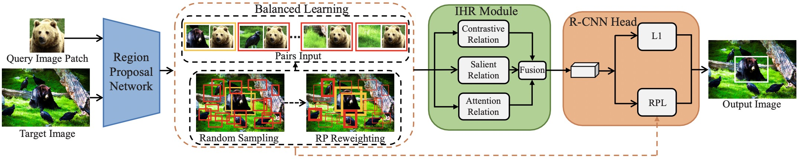

# Balanced and Hierarchical Relation Learning for One-shot Object Detection
This repository is an official implementation of the CVPR 2022 paper "Balanced and Hierarchical Relation Learning for One-shot Object Detection", based on [mmdetection](https://github.com/open-mmlab/mmdetection).


## Installation

1. Create a conda virtual environment and activate it

```shell
conda create -n BHRL python=3.7 -y
conda activate BHRL
```

2. Install PyTorch and torchvision 

```shell
conda install pytorch==1.7.1 torchvision==0.8.2 torchaudio==0.7.2 cudatoolkit=10.2 -c pytorch
```

3. Install mmcv

```shell
pip install mmcv-full==1.3.3 -f https://download.openmmlab.com/mmcv/dist/cu102/torch1.7.0/index.html
```

4. Install build requirements and then install MMDetection.

```shell
pip install -r requirements/build.txt
pip install -v -e . 
```

## Datasets Preparation

Download coco dataset and voc dataset from the official websites. 

Download voc_annotation from this [link](https://drive.google.com/drive/folders/1czLhPw65ILmiGU8z95qHGkVTi0EdTGiJ?usp=sharing).

Download ref_ann_file from this [link](https://drive.google.com/drive/folders/1GztcOl8ltCVv9YJdhuvFZq15LTwxWJ7M?usp=sharing).

We expect the directory structure to be the following:
```
BHRL
├── data
│   ├──coco
│   │   ├── annotations
│   │   ├── train2017
│   │   ├── val2017
│   ├──VOCdevkit
│   │   ├── voc_annotation
│   │   ├── VOC2007
│   │   ├── VOC2012
├── ref_ann_file
...
```

## Backbone Weight Preparation

Download the ResNet50 model for training from this [link](https://drive.google.com/file/d/1tcRtU-CBu1q00cnnZ6jiF2vvQCzY0a4P/view?usp=sharing).

```
BHRL
├── resnet_model
│   ├──res50_loadfrom.pth
```

## Inference with a pretrained model
```shell
./tools/dist_test.sh ${CONFIG} ${CHECKPOINT} ${GPUS} --out ${RESULTS} --eval bbox --average ${EVALUATION_NUMBER}

# e.g.,
# test unseen classes
./tools/dist_test.sh configs/coco/split1/BHRL.py checkpoints/model_split1.pth 8 --out results.pkl --eval bbox --average 5
# test seen classes
./tools/dist_test.sh configs/coco/split1/BHRL.py checkpoints/model_split1.pth 8 --out results.pkl --eval bbox --average 5 --test_seen_classes
```
Download the pretrained models for inferencing from this [link](https://drive.google.com/drive/folders/1emTPlHRT2_z3Rrgo1ltbcGyVvr3ZEF_v?usp=sharing).

## Train a model
```shell
./tools/dist_train.sh ${CONFIG} ${GPUS} --no-validate

# e.g.,
./tools/dist_train.sh configs/coco/split1/BHRL.py 8 --no-validate
```
Note: we observe an obvious variation of the performance for different runs on the VOC dataset due to its small amount of data, and we are still investigating possible solutions to stabilize the results. Moreover, the variation of performance on unseen classes is normal because the model is not trained on unseen classes.

## Contact 
For any questions, please contact hanqing.yang@zju.edu.cn

## Citation
If you find our work useful in your research, please consider citing:

```latex
@InProceedings{BHRL,
    author    = {Yang, Hanqing and Cai, Sijia and Sheng, Hualian and Deng, Bing and Huang, Jianqiang and Hua, Xiansheng and Tang, Yong and Zhang, Yu},
    title     = {Balanced and Hierarchical Relation Learning for One-shot Object Detection},
    booktitle = {Proceedings of the IEEE/CVF Conference on Computer Vision and Pattern Recognition (CVPR)},
    month     = {June},
    year      = {2022}
}
```
